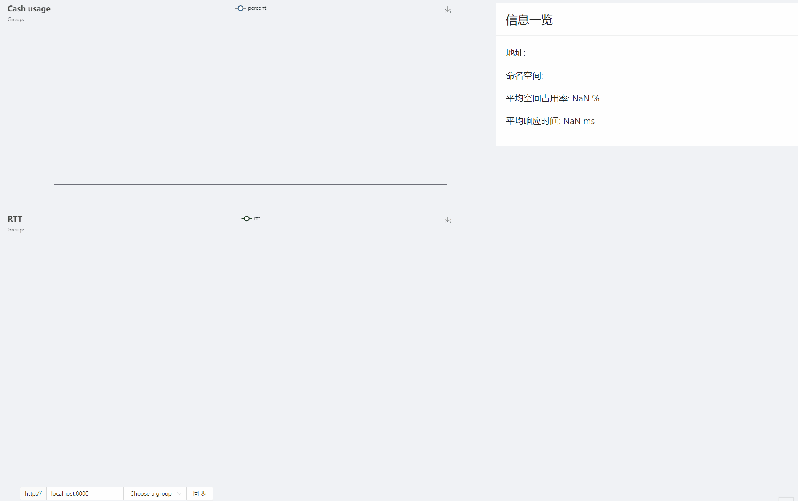

# Cash

Cash, is with the same pronunciation as **"Cache"**([kæʃ]). It's a Groupcache-like cache server.

### Get Started

Cash is a distributed cache system based on consistent hash, so you need to create several peers at first:

```go
peers := []string{"localhost:8000", "localhost:8001", "localhost:8002"}
peerMap := map[int]string{
   8000: "localhost:8000",
   8001: "localhost:8001",
   8002: "localhost:8002",
}
```

Then create a new http pool that running at your given address:

```go
pool := cash.NewHTTPPool("localhost:8000", peers)
```

Create some groups with different namespaces. Groups are independent from each other.

```go
pool.NewGroup(logLevel, maxVolume, "country", cash.GetterFunc(naiveGetter()))
pool.NewGroup(logLevel, maxVolume, "food", cash.GetterFunc(naiveGetter()))
```

Here, you are free to customize your getter function. Once the cash does not hit, it will try get the k-v pair through getter function. Getter function can fetch k-v pair from a database or another k-v store, and it's up to you. 

naiveGetter is a simple example just for display.

```go
func naiveGetter() func(key string) (cash.ByteView, error) {
	kvs := map[string]cash.ByteView{}
	return func(key string) (cash.ByteView, error) {
		if value, ok := kvs[key]; ok {
			return value, nil
		} else {
			return value, fmt.Errorf("no such key")
		}
	}
}
```

### Control flow

The httpPool is in charge of all the groups and the peers. That is to say, it knows where the peers and groups are and which key should be mapped to which peer.

It finds the peer according to the given key by using consistent hash algorithm. It provides a **PeerPicker** object for any groups, which is used to pick a peer.

Take **GET** operation for example, a group will firstly try get the k-v pair from the cache. If it luckily hits, then return the value, otherwise, it will try to get it from a peer. The group can get a **PeerClient** object by calling peerPicker.pick. The PeerClient is kind of like the stub of RPC, which provides a abstraction layer(Get, Put, etc) . The group can calling the interface very naturally.

```go
type PeerClient interface {
   Get(key string) (ByteView, error)
   Put(key string, value ByteView) error
   Del(key string) (ByteView, error)
}

type PeerPicker interface {
   PickPeer(key string, namespace string) PeerClient
}
```

The consistent hash and the abstraction make the distributed system behave like a single one. 


### Api

The cash is based on HTTP protocol. If you want to do some basic operations on a specific group, here are some examples.

#### Get the value of key "cake" from group "food"

by using **GET** method:

http://localhost:8000/__cash__/food?key=cake

#### Put "cake" -> "tasty" to group "food"

by using **PUT**  method:

http://localhost:8000/__cash__/food?key=cake&value=tasty

#### Del key "cake" from group "food"

by using **Delete** method:

http://localhost:8000/__cash__/food?key=cake

#### Get info of a given group

by using **GET** method:

http://localhost:8000/__cash__/food/info

Would return message like: 

```json
{"maxVolume":"2000","percent":"0.00","used":"0"}
```

#### Get info of groups

by using **GET** method:

http://localhost:8000/__cash__/__groups__

Would return message like:

```json
["country", "food"]
```

### Console

A very naive one, made by Typescript + React + Ant-Design + Echarts.

Simply monitor the usage of cash. 


